<div align="center">

# 🛡️ NuGetGuard

**Audit every NuGet package in your .NET solution in one command.**
Find vulnerable, deprecated and outdated packages, spot risky or proprietary licences, and clean up references you no longer need — as a terminal report or a shareable HTML page.


[**Install**](#-install) · [**Usage**](#-usage) · [**What it checks**](#-what-it-checks) · [**Docs**](docs/) · [**CI/CD**](#️-cicd)



</div>

<!-- After publishing to nuget.org, replace the static nuget.org badge above with the live ones:
     
     
     They render "package not found" until the package actually exists. -->

---

## ✨ What it checks

One scan runs six checks over every project in the solution:

| Check | What you get |
|---|---|
| **Vulnerable** | 🚨 Known CVEs, by severity, each linked to its advisory |
| **Deprecated** | ⚠️ Deprecated packages and the replacement the author recommends |
| **Outdated** | 📦 The latest version for everything you're behind on |
| **Licenses** | 📜 A licence per package: 🟢 permissive · 🟡 weak · 🔴 strong copyleft · 🔒 proprietary · ⚪ unknown |
| **Redundant** | 🔗 References already pulled in elsewhere — and whether removing one changes the resolved version |
| **Unused** | 🧹 Packages whose namespaces appear nowhere in your code |

Works with modern SDK-style projects, legacy `.NET Framework` (`packages.config`), Central Package Management, and both `.sln` and `.slnx`. The scan is read-only, stays offline by default, and never runs your packages' code.

<details>
<summary><strong>How is this different from the tools I already use?</strong></summary>

<br>

Each of these does one job, and several do it better than NuGetGuard does — `dotnet-outdated` can apply the updates for you, and `dotnet list package` is built into the SDK with no install at all:

| Tool | Covers |
|---|---|
| `dotnet list package --vulnerable/--outdated/--deprecated` | vulnerable · deprecated · outdated |
| [dotnet-outdated](https://www.nuget.org/packages/dotnet-outdated-tool) | outdated, and can upgrade them |
| [Snitch](https://www.nuget.org/packages/snitch) | redundant transitive references |
| [dotnet-project-licenses](https://www.nuget.org/packages/dotnet-project-licenses) | licence listing |

NuGetGuard runs **all six checks in one pass and one report**, adds licence *risk* classification and unused-package detection, and works on legacy `packages.config` projects that `dotnet list package` cannot read at all. If you only need one of the above, use the dedicated tool — it will serve you better.

</details>

📚 **[Documentation](docs/)** — [how it works](docs/how-it-works.md) · [the checks in depth](docs/checks.md) · [troubleshooting](docs/troubleshooting.md) · [architecture](docs/architecture.md)

---

## 📦 Install

> **Not published to nuget.org yet** — `dotnet tool install -g NuGetGuard` will not find the package. Publishing is planned; once it lands, installing and updating becomes a single command. Until then, install from source.

Needs the .NET SDK 8 or newer:

```bash
git clone https://github.com/MacTii/nuget-guard.git
cd nuget-guard
dotnet pack src/NuGetGuard/NuGetGuard.csproj -c Release -o artifacts
dotnet tool install -g NuGetGuard --add-source ./artifacts
```

Uninstall with `dotnet tool uninstall -g NuGetGuard`.

> Rebuilding later? Empty `artifacts/` first — `dotnet pack` never cleans it, and install takes the highest version it finds there. See [troubleshooting](docs/troubleshooting.md#the-installed-version-is-not-the-one-just-built).

<details>
<summary>Per-repository install instead of global</summary>

```bash
dotnet new tool-manifest                                    # once per repo
dotnet tool install NuGetGuard --add-source <path>/nuget-guard/artifacts
dotnet nuget-guard --export html                            # run it
```

Commit the manifest and teammates just run `dotnet tool restore`.

</details>

---

## 🚀 Usage

```bash
nuget-guard                                  # scan current directory
nuget-guard C:\Projects\MyApp                # scan a specific folder
nuget-guard --export html                    # HTML report, opens in browser
nuget-guard --export csv --output reports/audit
nuget-guard --fail-on vulnerable             # CI: non-zero exit on findings
```

| Option | Default | Description |
|---|---|---|
| `[path]` | `.` | Folder containing the solution (searched recursively) |
| `-e, --export` | `None` | `None` / `Csv` / `Html` |
| `-o, --output` | `nuget-report` | Output filename without extension |
| `--fail-on` | `None` | `Vulnerable` / `Deprecated` / `Outdated` / `StrongCopyleft` / `Unused` / `Any` |
| `--skip-redundant` | `false` | Skip redundancy analysis |
| `--skip-unused` | `false` | Skip unused-package analysis |
| `--online-licenses` | `false` | Resolve leftover unknown licenses via the ClearlyDefined API (slower, needs network) |
| `--no-open` | `false` | Don't open the HTML report |
| `-v, --version` | | Print the version and exit |

**Exit codes**

| Code | Meaning |
|---|---|
| `0` | Clean, or no `--fail-on` match |
| `1` | `--fail-on` condition triggered |
| `2` | No solution found |
| `-1` | Invalid usage — an unknown or mistyped option |

A mistyped option is an error, never a silent no-op: `--fail-on-vulnerable` (hyphen instead of a space) stops the run rather than scanning without the condition and reporting success.

`--fail-on Any` covers vulnerable, deprecated, outdated and strong-copyleft findings. Unused packages are excluded — that check is heuristic, so request it explicitly with `--fail-on Unused`.

**Reports** are written relative to the current directory: `<output>.html`, or `<output>.csv` + `<output>-licenses.csv`.

---

## 🔗 Redundant vs 🧹 unused

Different questions — a package can be one without being the other.

| | 🔗 Redundant | 🧹 Unused |
|---|---|---|
| Question | Does this line need to be in the project file? | Does any code touch this package? |
| How | Walks the dependency graph | Reads package namespaces, scans source |
| Fix | Drop the reference — the package stays available | Remove the package |

```
🔗 Redundant:  Newtonsoft.Json                 ← already pulled in by WebApi.Client
🧹 Unused:     Microsoft.AspNet.WebApi.Client  ← nothing in the code calls it
```

Opposite packages: Newtonsoft *is* used but needn't be listed; WebApi.Client *is* needed as its source but its own API is never called.

> Unused detection is a heuristic — packages wired up via configuration, DI or reflection have no namespace in the source and will be listed. Review before removing. In `packages.config` projects redundancy findings are informational only.

---

## 📊 Sample output

```
🔍 Scanning solution: MyApp.sln (4 projects)

━━━ 🚨 VULNERABLE PACKAGES ━━━
  📦 Newtonsoft.Json 12.0.1
     Severity : High
     Advisory : https://github.com/advisories/GHSA-5crp-9r3c-p9vr
     Projects : MyApp.Api, MyApp.Worker

━━━ ⚠️ DEPRECATED PACKAGES ━━━
  📦 EntityFramework 6.2.0
     Reason      : Legacy
     Alternative : EntityFramework [6.5.1, )
     Projects    : MyApp.Data

━━━ 📦 OUTDATED PACKAGES ━━━
  📦 Serilog 3.0.1
     Latest: 4.4.0
     Projects: MyApp.Api, MyApp.Worker

━━━ 📜 LICENSE AUDIT ━━━
  🔴 StrongCopyleft (1)
     📦 iText7 8.0.1  [AGPL-3.0]  → https://www.nuget.org/packages/iText7/8.0.1/license
  🔒 Proprietary (1)
     📦 WebGrease 1.6.0  [MS-EULA]  → http://www.microsoft.com/web/webpi/eula/aspnetcomponent_rtw_ENU.htm

━━━ 🔗 REDUNDANT PACKAGES (covered transitively) ━━━
  📂 MyApp.Api  (SDK)
     🔗 Newtonsoft.Json 12.0.1  ← pulled by  Microsoft.AspNet.WebApi.Client 5.2.7

━━━ 🧹 POSSIBLY UNUSED PACKAGES ━━━
  📂 MyApp.Worker  (SDK)
     🧹 AutoMapper 13.0.1  no code references AutoMapper, +4 more

━━━ 📊 SUMMARY ━━━
  Vulnerable      : 🚨 1
  Deprecated      : ⚠️ 1
  Outdated        : 📦 5
  Redundant       : 🔗 1
  Possibly unused : 🧹 1
  Licenses total  : 12  (🔴 StrongCopyleft: 1  🔒 Proprietary: 1  ⚪ Unknown: 0)
```

All sections also appear in the HTML and CSV exports. Alternatives are shown in NuGet version-range notation, so `[6.5.1, )` means 6.5.1 or newer.

---

## 🏗️ CI/CD

No package feed needed — the pipeline builds the tool from this repository.

**GitLab CI** (`.gitlab-ci.yml`):

```yaml
nuget-audit:
  stage: test
  image: mcr.microsoft.com/dotnet/sdk:8.0
  script:
    - git clone --depth 1 https://github.com/MacTii/nuget-guard.git /tmp/ng
    - dotnet pack /tmp/ng/src/NuGetGuard/NuGetGuard.csproj -c Release -o /tmp/ng/artifacts
    - dotnet tool install -g NuGetGuard --add-source /tmp/ng/artifacts
    - export PATH="$PATH:/root/.dotnet/tools"
    - nuget-guard --export html --output nuget-audit --no-open --fail-on vulnerable
  artifacts:
    when: always          # keep the report even when the job fails
    paths: [nuget-audit.html]
    expire_in: 30 days
```

**GitHub Actions** (`.github/workflows/nuget-audit.yml`):

```yaml
- name: Install NuGetGuard
  run: |
    git clone --depth 1 https://github.com/MacTii/nuget-guard.git ${{ runner.temp }}/ng
    dotnet pack ${{ runner.temp }}/ng/src/NuGetGuard/NuGetGuard.csproj -c Release -o ${{ runner.temp }}/ng/artifacts
    dotnet tool install -g NuGetGuard --add-source ${{ runner.temp }}/ng/artifacts

- name: Audit NuGet packages
  run: nuget-guard --export csv --output nuget-audit --fail-on vulnerable

- name: Upload report
  if: always()
  uses: actions/upload-artifact@v4
  with:
    name: nuget-audit
    path: nuget-audit*.csv
```

Alternatives: commit the `.nupkg` next to a tool manifest and run `dotnet tool restore`, or push it to a private GitLab/GitHub NuGet feed.

---

## 📁 Structure

```
nuget-guard/
├── NuGetGuard.slnx
├── src/NuGetGuard/            # tool source
│   ├── Commands/              # CLI layer (Spectre.Console.Cli)
│   ├── Services/              # scanning, licenses, redundancy, unused detection
│   │   ├── DotNet/            # dotnet / nuget.exe integration + JSON models
│   │   └── NuGetApi/          # NuGet registration API client + models
│   ├── Reporting/             # console / CSV / HTML output
│   └── Models/                # report model
├── tests/NuGetGuard.Tests/    # unit tests — no network required
├── docs/                      # how it works, checks in depth, troubleshooting
├── legacy/
│   └── Scan-Packages.ps1      # original PowerShell version, no longer developed
└── README.md
```

Build and test locally with `dotnet test`.

---

## 📄 License

MIT — free to use, modify and distribute.
